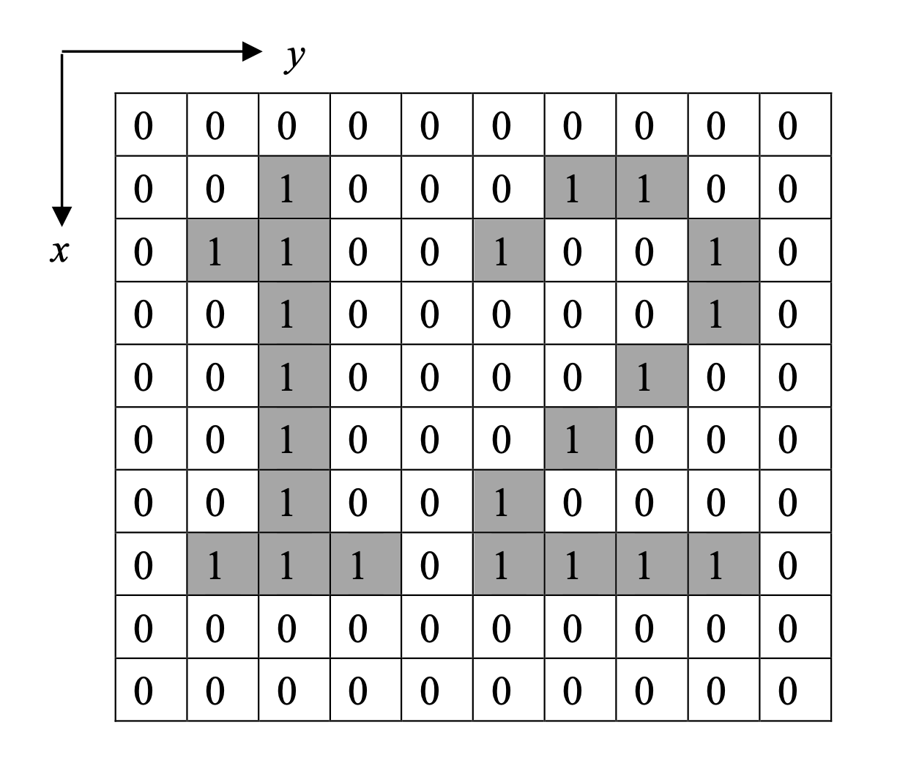
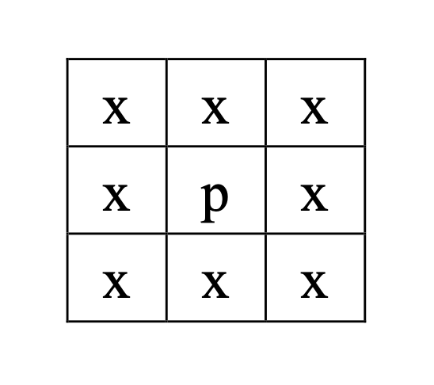
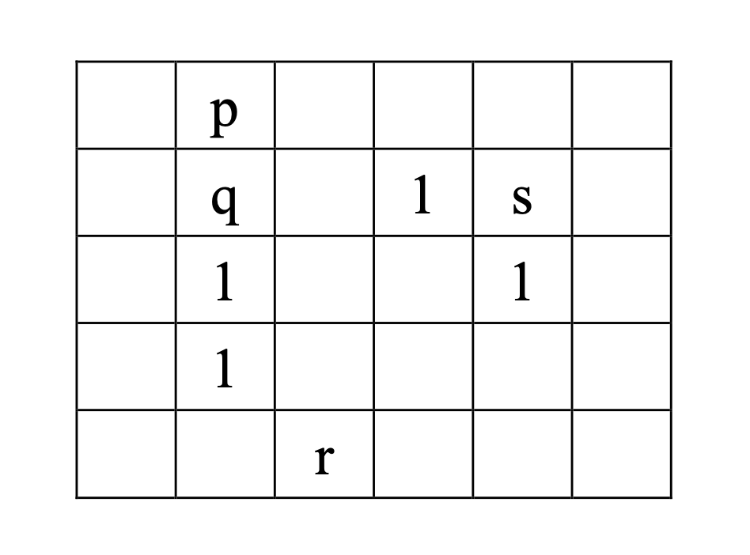
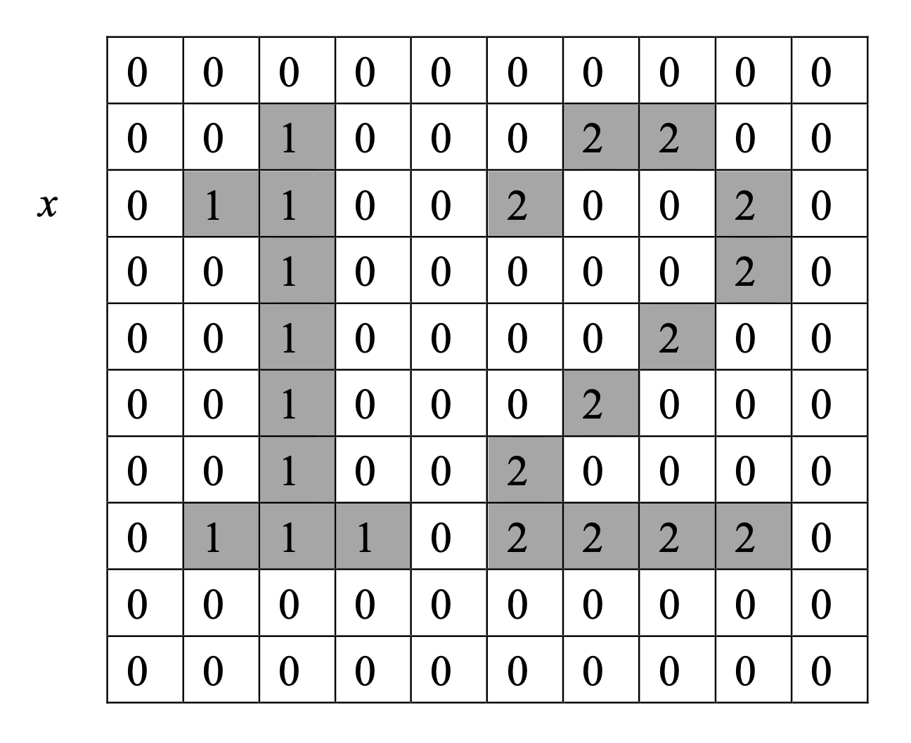

# connected-component-labeling
a practice for Connected Component Labeling (CCL) in images

## 題目
假設給定一數位影像 (如圖)，其基本構成元素稱為像素 (Pixel)，本例為 10 × 10 之像，其中像素值僅含 0 或 1 值，因此這樣的影像又常稱為二值影像 (Binary Image)。數位影像常以二維矩陣表示，其 (x, y) 座標如圖表示，因此左上角座標為 (0, 0)、左下角座標為 (9, 0)、右上角座標為 (0, 9)、右下角座標為 (9, 9)，其他座標以此類推。



以下圖為例，考慮某像素 p，則像素 x 均視為與像素 p「相鄰」(Adjacent) 之像素。若兩像素間含有互相相鄰之像素路徑，則視為「相連」 (Connected)。以下圖為例 (未標記之像素值為 0)，像素 p 與像素 q 相鄰且相連，像素 p 與像素 r 相連但不相鄰，像素 p 與像素 s 不相
鄰也不相連。連通元 (Connected Component) 則可定義為相連通之像素集合。

 


連通元標記的目的即是在給定某一二值影像，標記影像中的連通元，結果範例如下：



由圖可見連通元標記的結果即是對影像中每一連通元像素給予特定標籤 (Label)，且依 1、2、3... 等順序安排。連通元標記後可決定影像中連通元的個數。標記之標籤原則上依由左而右、由上而下依序排列，且沒有跳號現象。此外，依每個連通元計算其面積 (即總像素個數)，上例中，連通元 #1 之面積為 10、連通元 #2 之面積為 12。

## 輸入說明
輸入依下列次序安排，每組輸入資料代表一張二值影像，首先為影像的大小，依高 × 寬安排(最大為100 × 100)，影像大小為 0 × 0 代表結束，接著為二值影像，像素值僅含 0 或 1，但影像中可能含有多個連通元。

## 輸出說明
輸出應包含下列資訊：(1) 輸入影像編號；(2) 連通元個數；及 (3) 各連通元面積。

## 輸入 / 輸出範例
輸入：  
10 10  
0000000000  
0010001100  
0110010010  
0010000010  
0010000100  
0010001000  
0010010000  
0111011110  
0000000000  
0000000000  
8 5  
00001  
00011  
00111  
00000  
11001  
11001  
10000  
00000  
0 0  

輸出：  
Image #1  
Number of Connected Components = 2  
Connected Component #1 Area = 10  
Connected Component #2 Area = 12  
Image #2  
Number of Connected Components = 3  
Connected Component #1 Area = 6  
Connected Component #2 Area = 5  
Connected Component #3 Area = 2  

## 程式實際執行狀況
```
$ python3 main.py
10 10
0000000000
0010001100
0110010010
0010000010
0010000100
0010001000
0010010000
0111011110
0000000000
0000000000
8 5
00001
00011
00111
00000
11001
11001
10000
00000
0 0
Image #1
Number of Connected Components = 2
Connected Component #1 Area = 10
Connected Component #2 Area = 12

Image #2
Number of Connected Components = 3
Connected Component #1 Area = 6
Connected Component #2 Area = 5
Connected Component #3 Area = 2
```
