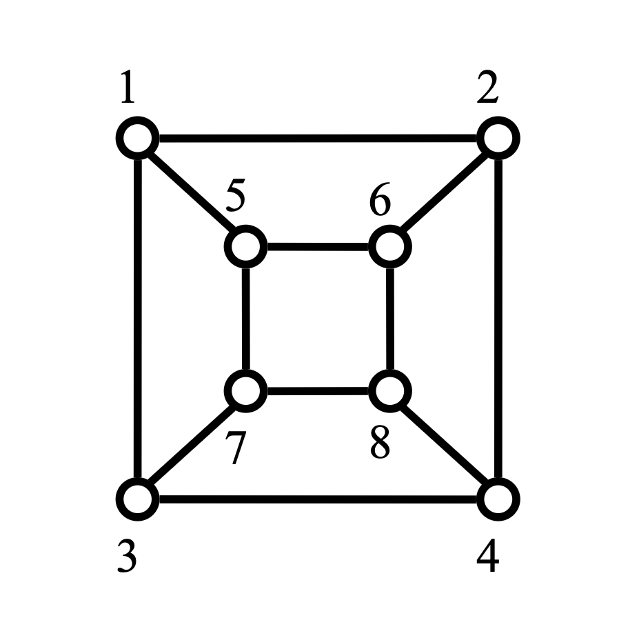

# hamiltonian-cycle-traversal
a practice for implementing and exploring Hamiltonian cycle traversal in graphs

## 題目
給定一圖形 $G = (V, E)$，其中 $V$ 代表**頂點** (Vertex) 集合，依阿拉伯數字 1, 2, ... 等安排； $E$ 代表**邊** (Edge) 的集合，依其連接的頂點定義。以下圖為例，則頂點的個數為 $|V| = 8$，邊的個數為 $|E| = 12$。  

漢密爾頓迴圈 (Hamiltonian Cycle) 的定義如下：從某一頂點出發 (如頂點 1)，陸續對其他頂點走訪，但每一頂點僅能走訪一次，且回到原出發點形成迴圈。本題中，將給定圖形，且漢密爾頓迴圈一定存在，用程式列出其中一個漢密爾頓迴圈，且其出發點為頂點 1。

以上圖為例，則其中一個漢密頓迴圈為：1 2 4 3 7 8 6 5 1 (起點及終點均為頂點 1)。
【註】答案不一定是唯一，僅須列出其中一個漢密頓迴圈即可。

## 輸入說明
第一行為頂點及邊的數目 (以空格隔開)，緊接依序為連接邊的兩個頂點，0 0 代表結束。

## 輸出說明
列出其中一個漢密頓迴圈（分別以空格隔開），但起點及終點均為頂點 1。

## 輸入範例
 (同上面圖形)  
8 12  
1 2  
1 3  
1 5  
2 4  
2 6  
3 4  
3 7  
4 8  
5 6  
5 7  
6 8  
7 8  
0 0

## 輸出範例
1 2 4 3 7 8 6 5 1
