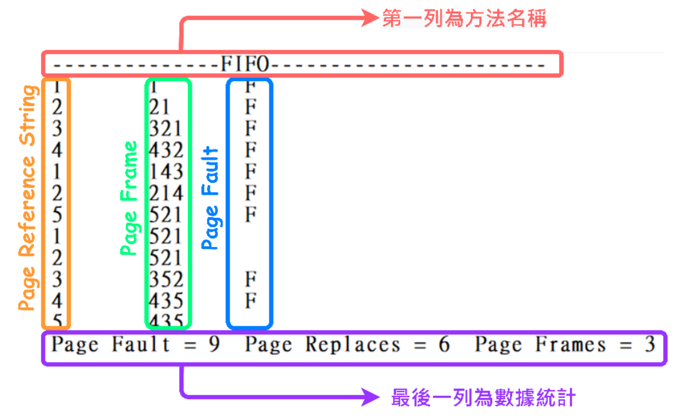

# os-page-replacement-algorithms
This practice contains Python implementations of classic page replacement algorithms for operating system practice, 
including FIFO, LRU, LFU+FIFO, MFU+FIFO, LFU+LRU, and a combined ALL method.

## 實現以下方法
1. First In First Out (FIFO)
2. Least Recently Used (LRU)
3. Least Frequently Used (LFU) + FIFO
4. Most Frequently Used (MFU) + FIFO
5. LFU + LRU
6. ALL

## 讀檔格式
第 1 列的第 1 個數字為方法，方法 1 到 6：
1. FIFO
2. LRU
3. LFU+FIFO
4. MFU+FIFO
5. LFU+LRU
6. ALL  

第 1 列的第 2 個數字為 Page Frame 的個數，皆為正整數，範圍不定。

第 2 列為 Page Reference 的次序。  

不同欄位之間會用 "空白" 或是 "tab" 隔開。

**詳細輸入格式請參照 [`input/`](input/) 資料夾中的檔案**。

## 寫檔格式
Output 檔名格式：out_{ Input File Name }.txt，如 [`output/`](output/) 資料夾中的檔案，此資料夾有所有 input 檔案的輸出。 
每個檔案的輸出格式（如下圖）：
- 第一列 (紅色框)：方法名稱
- 中間列：Page Reference 的詳細資訊  
    第一行 (橘色框)：Page Reference String  
    第二行 (綠色框)：Page Frame 紀錄的內容（根據 Page 被參考的順序由左至右排序）  
    第三行 (藍色框)：發生Page Fault 的時間點
- 最後一列 (紫色框)：數據統計（Page Fault、Page Replaces、Page Frames）

  

**詳細輸出格式請參照 [`output/`](output/) 資料夾中的檔案**，尤其是分隔符號「-」、White Space、方法名稱（大小寫）、方法順序、Page Frame 順序、數據統計之順序。

## 程式執行方式
[main.py](main.py) 編譯並執行後會提供輸入，使用者輸入欲測試的檔案之檔名。
```
Enter file name (eg. input1_method1, input2 ...) : 
```

## 結果
詳細書面報告在 [report.pdf](report.pdf) 中。
