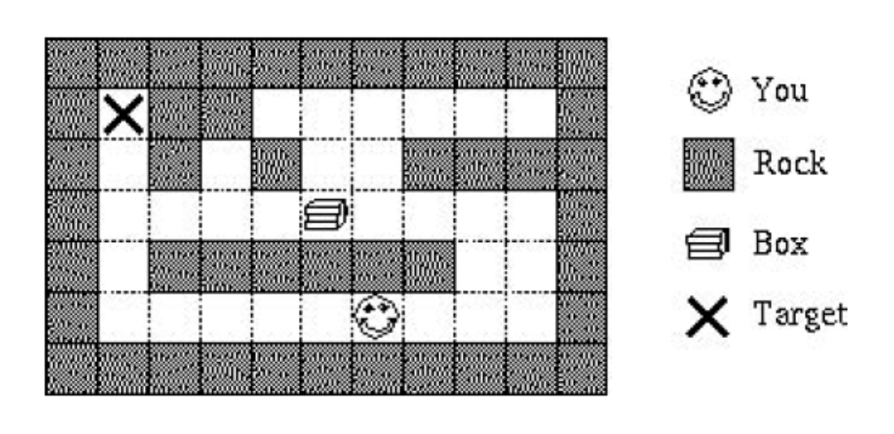

# pushing-box-game
a practice for solving the Pushing Box Game in a 2D maze

## 題目
假設你身處在二維的迷宮之中 (如圖)，迷宮中可能含有 (或不含) 大石塊 (Rock)，在沒有大石塊阻擋時，你可以向東、西、南、北等四方向一次移動一格。其中一格擺了一個箱子 (Box)，你只可以向箱子移動的方向推，譬如：若你站在箱子的東面，則你只能向西面推箱子; 若你站在箱子的南面，則你只能向北面推箱子; 以此類推。在任何情況下，由於箱子非常沉重，你都無法拉動箱子，萬一你把箱子推到死角，則你將再沒機會移動箱子。如圖所示，有一目標 (Target)，你的工作是將箱子推到指定的目標，由於箱子非常沉重，因此推動箱子次數必須最少，試設計 Python 程式解決這個問題。



## 輸入說明
輸入含有幾個迷宮，每一個迷宮首先定義迷宮的大小為 r 及 c，分別代表迷宮的列數及行數 (其中，r、c <= 20)。緊接為 r 列，每一列含 c 個字元 (Characters)，其中，大石塊用 # 表示，空格用 . 表示。你的初始位置為 S，箱子的初始位置為 B，目標的位置為 T。當輸入之 r 及 c 為 0 時代表結束。

## 輸出說明
首先，列出迷宮的編號。接著，印出一組推動箱子的方向。若無法將箱子推到指定的目標，則列出 Impossible 。若有兩組推動箱子的次數均為最少，則列出總移動數最少的 (即含移動及推動的次數)。使用 E, W, S, N, e, w, s, n 分別代表推動或移動的方向 (東、西、南、北)，大寫表示目前需推動箱子，小寫表示僅需移動。迷宮與迷宮間則以空行隔開。

## 輸入 / 輸出範例
輸入：  
1 7  
SB....T  
1 7  
SB..#.T  
7 11  
###########  
#T##......#  
#.#.#..####  
#....B....#  
#.######..#  
#.....S...#  
###########  
0 0  
【註】本範例與上圖相同

輸出：  
Maze #1  
EEEEE  
Maze #2  
Impossible  
Maze #3  
eennwwWWWWeeeeeesswwwwwwwnNN

## 程式實際執行狀況
```
$ python3 main.py
請輸入兩個整數 r c 表示迷宮大小（例如：7 11），輸入 0 0 結束：
1 7
SB....T
1 7
SB..#.T
7 11
###########
#T##......#
#.#.#..####
#....B....#
#.######..#
#.....S...#
###########
0 0
Maze #1
EEEEE

Maze #2
Impossible

Maze #3
eennwwWWWWeeeeeesswwwwwwwnNN

```
