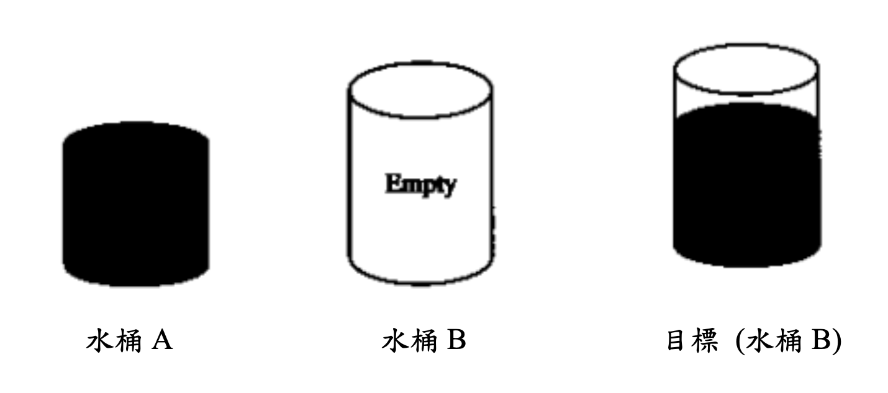

# water-jug-puzzle
a practice for solving the classic Water Jug Puzzle

## 題目
假設有兩個水桶及一個水池 (無限供應水)，兩個水桶的容量均為已知，但是都沒有刻度，
所以你只能進行下列三種動作：  
1. Fill 將水桶的水裝滿
2. Empty 將水桶的水倒光
3. Pour 將其中一個水桶的水倒到另一個水桶

其中，第三種動作僅有兩種可能，即第一個水桶的水須全部倒光、或是第二個水桶已裝滿便算結束。舉例說明，假設水桶 A 及水桶 B 都可容納 8 公升，若此時水桶 A 有 5 公升，水桶 B 有 6 公升，第一種動作可將水桶 A 裝滿，第二種動作可將水桶 A 倒光，第三種動作可將水桶 A 的水倒入水桶 B，但僅可將水桶 B 裝滿到 8 公升，使得水桶 A 剩下 3 公升。

水桶謎題的目的在使水桶 B 達到某給定的水量 (公升)，如圖所示為範例，若水桶 A 的容量為 3 公升，水桶 B 的容量為 5 公升，目標水量為 4 公升，則可達到目標的順序如下： 

    Fill A  
    our A B  
    Fill A
    Pour A B
    Empty B
    Pour A B
    Fill A
    Pour A B
    Success

其中，Pour A B 表示將水桶 A 倒水到水桶 B 中。



【註一】本題中你可以假設給定的謎題一定有解。  
【註二】水桶 A 與水桶 B 在剛開始時皆是空的。

## 輸入說明
每組有三個數字，第一個數字為水桶 A 的容量，第二個數字為水桶 B 的容量，第三個數字為目標容量，單位均為公升。輸入為 0 0 0 時則結束。

## 輸出說明
列出達到目標的順序。Case 與 Case 間空一行。

## 輸入 / 輸出範例
輸入：  
3 5 4  
5 7 3  
0 0 0  

輸出：  
Case #1  
Fill A  
Pour A B  
Fill A  
Pour A B  
Empty B  
Pour A B  
Fill A  
Pour A B  
Success  

Case #2  
Fill A  
Pour A B  
Fill A  
Pour A B  
Empty B  
Pour A B  
Success

## 程式實際執行狀況
```
$ python3 main.py
請依序輸入 A B Target（例如：3 5 4），輸入 0 0 0 結束：
3 5 4
5 7 3
0 0 0
Case #1
Fill A
Pour A B
Fill A
Pour A B
Empty B
Pour A B
Fill A
Pour A B
Success

Case #2
Fill A
Pour A B
Fill A
Pour A B
Empty B
Pour A B
Success

```
